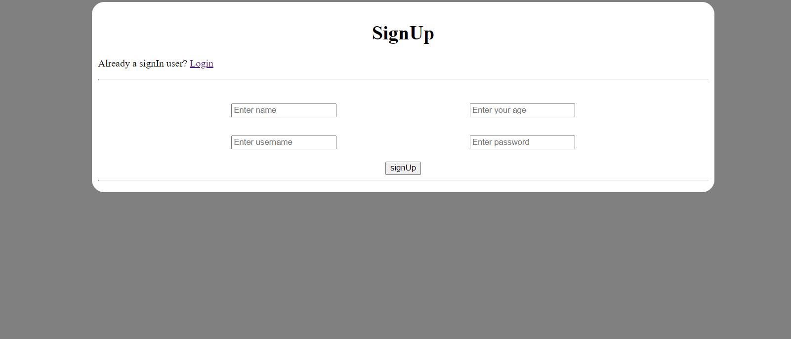
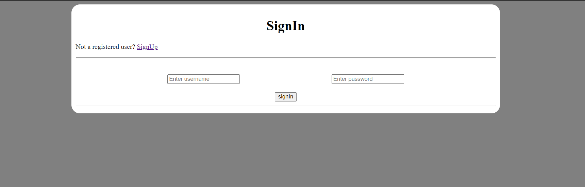
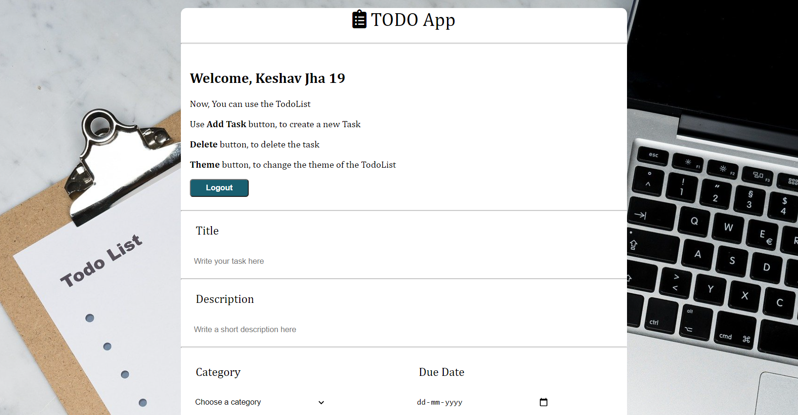
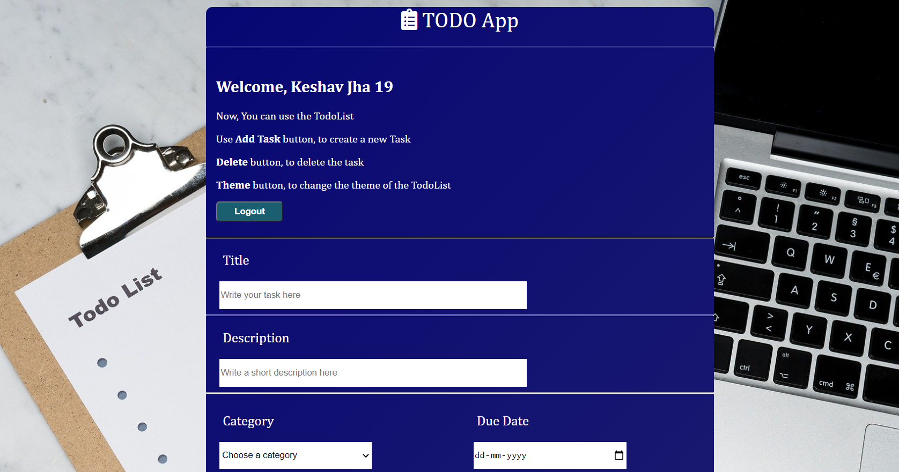
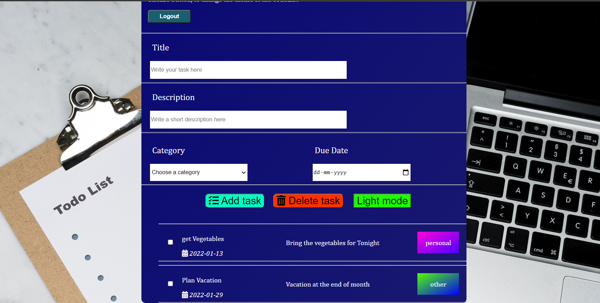

# TodoList

It is a simple TodoList that contains the basic functionality like adding a task deleting a task 
provide title and give a brief description of the tasks.

## Content structure

It contains 3 different web pages 
1. Signup page
2. signin page
3. Main TodoList

## Authentication 

Authentication is done through passport (Local strategy).

### SignUp Page

### SignIn Page

## Main TodoList

This main TodoList has all the features of adding a tasks, deleting a task and there is one theme button as well in order to toggle b/w light and dark mode.
 
### Light Mode 

### Dark Mode 

## How To Use?
First download this repo then use your terminal (VS Code) to go to the project directory and then type "npm start" without quotes.
This will run the project on port :- 3800
go to chrome and write in url :- http://localhost:3800/ Or [click here](http://localhost:3800/user/signin)

Then if not a signed in user then switch to signUp page after thus just signIn to get to the main TodoList Page.

After reaching the main TodoList Page you can see web page like this:-

You can delete a task by checking the check box of the task that you want to delete, and then click delete Task.
